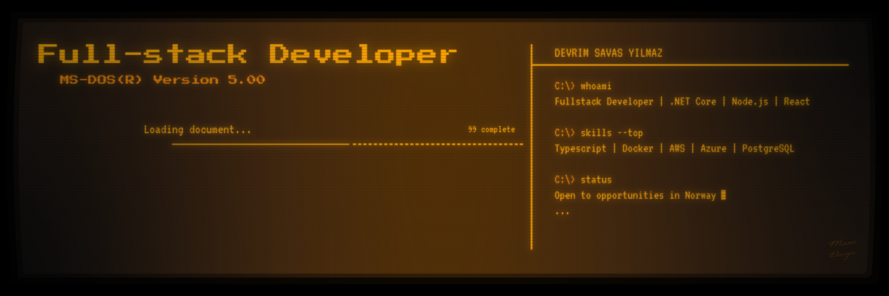

# Hi, I'm Devrim 👋
### Full-Stack Developer · Backend Specialist · Mentor

*Building scalable, data-driven applications — from React frontends to .NET and Node.js backends*

---

## 🙋 About Me

I'm a full-stack developer based in **Drammen, Norway**, with a strong focus on back-end architecture, cloud deployments, and clean API design. I enjoy turning complex problems into maintainable, well-structured solutions.

- 🔭 Currently building **[BIT4](https://github.com/devrimsavas/CPU-4-BIT-EMULATOR)** — a handcrafted 4-bit CPU emulator with custom ISA, ALU, RAM and VPU, built from scratch in C#
- 🧑‍🏫 Former instructor at **JobLoop** and mentor at **Noroff** — taught C#, ASP.NET, Node.js and JavaScript
- 🤖 Daily user of **GitHub Copilot** and **Cursor** for AI-assisted development
- 🌍 Fluent in 6 languages: English, Norwegian, Turkish, German, French, Russian
- 🕹️ Hobby: building **hardware emulators** in my spare time

---

## 🛠️ Tech Stack

### Frontend

### Backend

### Databases

### Cloud & DevOps

---

## 🚀 Featured Projects

| Project | Description | Tech |
|---|---|---|
| [**BIT4 – 4-bit CPU Emulator**](https://github.com/devrimsavas/CPU-4-BIT-EMULATOR) | Handcrafted 4-bit computer architecture built from scratch — custom CPU, ALU, RAM, VPU, assembler and instruction set. No frameworks. | C#, WinForms |
| [**NorskHandverk**](https://github.com/devrimsavas/NorskHandverk) | Full-stack e-commerce platform with Stripe payments, dynamic cart and webhook handling | .NET 9, Next.js 14, PostgreSQL, Stripe |
| [**NOVAMED**](https://github.com/devrimsavas/Clinic-Appointment-FullStack) | Clinic appointment system with patient, doctor, staff and admin roles, JWT auth and full CRUD | ASP.NET 8, Next.js 14, Tailwind, MySQL |
| [**Hotel Management**](https://github.com/devrimsavas/HotelManagementA) | Hotel booking and management system with room availability, reservations and admin dashboard | ASP.NET, C# |
| [**Movie Theater**](https://github.com/devrimsavas/Movie_Theater_New) | Cinema ticketing system with seat selection, scheduling and booking management | Node.js, PostgreSQL |

---

## 📊 GitHub Stats

---

## 📬 Get in Touch

I'm open to new opportunities and collaborations. Feel free to reach out!

- 📧 **devrimsavasyilmaz@gmail.com**
- 💼 [LinkedIn](https://www.linkedin.com/in/devrim-savas-yilmaz-442b43384/)
