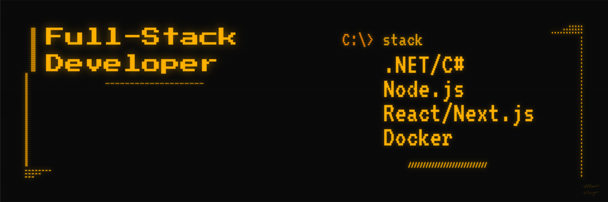

# Hi, I'm Devrim 👋
### Full-Stack Developer · Backend Specialist · Mentor

*Building scalable, data-driven applications — from React frontends to .NET and Node.js backends*

---

## 🙋 About Me

I'm a full-stack developer based in **Drammen, Norway**, with a strong focus on back-end architecture, cloud deployments, and clean API design. I enjoy turning complex problems into maintainable, well-structured solutions.

- 🔭 Currently building **[BIT4](https://github.com/devrimsavas/CPU-4-BIT-EMULATOR)** — a handcrafted 4-bit CPU emulator with custom ISA, ALU, RAM and VPU, built from scratch in C#, as part of a broader hobby in building hardware emulators
- 🔌 Built microservices using four different communication patterns — REST gateway, WebSockets, RabbitMQ, and ETL data streaming
- 📈 Actively expanding into **GCP**, **Kotlin**, and **Terraform/IaC** — building on existing Azure, Java and Docker/Kubernetes experience
- 🧑‍🏫 Former instructor at **JobLoop** and mentor at **Noroff** — taught C#, ASP.NET, Node.js and JavaScript
- 🤖 Daily user of **GitHub Copilot** and **Cursor** for AI-assisted development
- 🌍 Fluent in 6 languages: English, Norwegian, Turkish, German, French, Russian

---

## 🛠️ Tech Stack

### Frontend

### Backend

### Databases

### Cloud & DevOps

---

## 🚀 Featured Projects

| Project | Description | Tech |
|---|---|---|
| [**NorskHandverk**](https://github.com/devrimsavas/NorskHandverk) | Full-stack e-commerce platform with Stripe payments (idempotent checkout, webhooks), dynamic cart and relational data modeling *(in progress)* | .NET 9, Next.js 16, PostgreSQL, Stripe |
| [**ETL & Microservices with AdventureWorks**](https://github.com/devrimsavas/ETL-MicroService-Msql) | End-to-end data pipeline: microservices architecture over a shared SQL database, ETL transformations, Power BI visualizations, and CI via GitHub Actions | Node.js, Express, MSSQL, Power BI |
| [**Clinic Queue Management (mediq-fifo)**](https://github.com/devrimsavas/mediq-fifo-microservices) | Real-time FIFO queue system for a medical practice — gateway + 3 microservices with live WebSocket updates for patients and staff | Node.js, Express, WebSockets, Microservices |
| [**NOVAMED**](https://github.com/devrimsavas/Clinic-Appointment-FullStack) | Clinic appointment system with patient, doctor, staff and admin roles and full CRUD | ASP.NET 8, Next.js 14, Tailwind, MySQL |
| [**DevHouse4**](https://github.com/devrimsavas/DevHouse4) | REST API for managing developers, teams, and projects with JWT auth and Swagger docs | ASP.NET Core, EF Core, Swagger, Docker |
| [**SnapShop E-Commerce**](https://github.com/devrimsavas/ecommerce-platform) | Full-stack e-commerce platform with role-based access (admin/user/guest), Sequelize/MySQL, JWT auth, and automated Jest + Supertest tests | Node.js, Express, Sequelize, MySQL, Jest |
| [**RabbitStock Demo**](https://github.com/devrimsavas/rabbitstockdemo) | Event-driven microservices demo using RabbitMQ for async messaging between inventory and order services | TypeScript, Node.js, RabbitMQ, Docker |
| [**BIT4 – 4-bit CPU Emulator**](https://github.com/devrimsavas/CPU-4-BIT-EMULATOR) | Handcrafted 4-bit computer architecture built from scratch — custom CPU, ALU, RAM, VPU, assembler and instruction set. No frameworks. | C#, WinForms |

---

## 📬 Get in Touch

I'm open to new opportunities and collaborations. Feel free to reach out!

- 📧 **devrimsavasyilmaz@gmail.com**
- 💼 [LinkedIn](https://www.linkedin.com/in/devrim-savas-yilmaz-442b43384/)
- 🌐 [Portfolio](https://portfolioviewer.onrender.com/)
